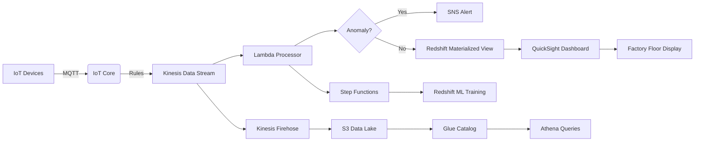

Industrial IoT Data Pipeline on AWS

This repository implements a production-grade IoT analytics pipeline using AWS services. It is designed to ingest high-frequency sensor data, detect anomalies in real-time, store and query historical data, and visualize insights on a dashboard.

Project Structure

.
├── lib/                      - Infrastructure-as-code (AWS CDK)
│   └── pipeline-stack.ts
├── lambda/                   - Stream processor Lambda function
│   └── processor.py
├── sql/                      - Redshift table definitions
│   └── sensor_schema.sql
├── states/                   - Step Functions orchestration logic
│   └── pipeline.asl.json
├── dashboard/                - QuickSight dashboard layout
│   └── template.json
├── scripts/                  - Setup and deployment shell scripts
│   ├── deploy_infrastructure.sh
│   ├── register_devices.sh
│   └── access_dashboard.sh
├── simulator/                - MQTT data simulator
│   └── data_simulator.py
├── cloudformation_templates/ - Raw CloudFormation templates from CDK synth
│   ├── IotPipelineStack.template.json
│   └── FastFirehoseStack.template.json
├── assets/                   - Architecture diagram and screenshots
│   ├── technical_architecture.png
│   ├── Technical Architecture.mermaid
│   ├── firehose_config.png
│   ├── lambda_execution_log.png
│   ├── lambda_log_success.png
│   ├── lambda_trigger_kinesis.png
│   └── S3bucket.png
├── .gitignore
├── LICENSE
├── requirements.txt
├── CONTRIBUTING.md
└── README.md

Installation Requirements

- AWS CLI and credentials
- AWS CDK (with Node.js)
- Python 3.9+ with boto3 and paho-mqtt

Installation and Deployment

1. Install dependencies:

   pip install -r requirements.txt

2. Deploy infrastructure:

   bash scripts/deploy_infrastructure.sh

3. Register simulated devices:

   bash scripts/register_devices.sh

4. Run simulator:

   python3 simulator/data_simulator.py

Architecture Diagram

If your environment doesn't support Mermaid, refer to:
- Static image: assets/technical_architecture.png
- Source file: assets/Technical Architecture.mermaid

Sample Screenshots

- Kinesis Firehose config: assets/firehose_config.png
- Lambda execution logs: assets/lambda_execution_log.png, lambda_log_success.png
- Lambda trigger: assets/lambda_trigger_kinesis.png
- S3 bucket view: assets/S3bucket.png

Security

IAM, encryption, and managed AWS service boundaries are used to enforce isolation and secure data transmission and storage.

Author

Fereydoon Boroojerdi - 2025
